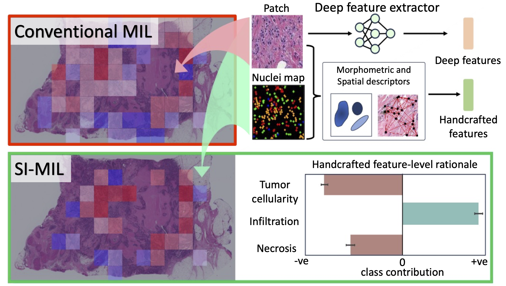

# SI-MIL: Taming Deep MIL for Self-Interpretability in Gigapixel Histopathology


Official code for our CVPR 2024 publication [SI-MIL: Taming Deep MIL for Self-Interpretability in Gigapixel Histopathology](https://arxiv.org/pdf/2312.15010). 


## Requirements
To install python dependencies, 

```
conda create -n simil python==3.9
conda activate simil
conda install -c conda-forge openslide
pip install openslide-python opencv-python pandas scikit-image scipy shapely scikit-learn networkx astropy community multiprocess torch torchvision torchaudio albumentations wandb tqdm matplotlib pillow gdown docopt imgaug termcolor 

```

## Organizing Data

Detailed description for curating data for SI-MIL is provided in the directory [data_curation](https://github.com/bmi-imaginelab/SI-MIL/tree/main/data_curation). 

## Open-source Data contribution

Given the extensive computation (both GPU and CPU) required for extracting cell maps from HoVer-Net and following Path Expert feature extraction, here we provide the following:

Nuclei maps for TCGA-BRCA, TCGA-LUAD, TCGA-LUSC, TCGA-COAD, TCGA-READ: https://stonybrookmedicine.box.com/s/89me9gynlzel0m6ud0bji5vpkqvxh9ed

PathExpert features and Deep features (DINO SSL) along with corresponding dictionary files for training/evaluating SI-MIL: https://stonybrookmedicine.box.com/s/ewylzthdisg5j5fvqsi2etpedqvc409v

Note that this curated dataset is temporarily made available at Box, and eventually we plan to make it available at TCIA portal. 


## Training

Following curating the data as explained above, we are now ready to feed the extracted PathExpert and Deep features for training our interpretable SI-MIL. 

Example training command:

```
features_dir='path/to/test_dataset/features'

python train.py   --organ 'test_organ' --dataset_split_path "$features_dir/train_dict.pickle" \
--dataset_split_path_test "$features_dir/test_dict.pickle"  --dataset_split_deep_path "$features_dir/train_dict_deep.pickle" \
--dataset_split_deep_path_test "$features_dir/test_dict_deep.pickle" \
--features_deep_path "$features_dir/trainfeat_deep.pth"  --features_deep_path_test "$features_dir/testfeat_deep.pth" \
--features_path "$features_dir/binned_hcf.csv" --save_path "$features_dir/MIL_experiment" \
--dropout_patch 0.4 --num_epochs 40 --weight_decay 0.01 \
--lr 0.0002 --top_k 20 --gpu_index 0  --use_additive 'yes'  --dropout_node 0.0  \
--no_projection 'yes'   --feat_type 'patchattn_with_featattn_mlpmixer_Lmse'  --stop_gradient 'no' \
--cross_val_fold 0 --temperature 3.0  --percentile 0.75 --torch_seed -1
```

In sample_train_mil.sh bash file, we provide example to conduct cross-validation in parallel and also experimenting with range of hyperparamters (num_epochs, dropout_patch, top_k, etc). Further we provide which arguments to toggle/change for training different versions of SI-MIL (i.e with or without stop gradient and/or knowledge distillation) as shown in our main paper Table 1. 

Note that, you need to make a wandb account and create a project with name 'Interpretable_MIL' to log all the training curves and results. 

## Inference

After training the interpretable SI-MIL model, run the following command to evaluate the performance of model on test set as well as saving the patch and feature level attention, along with various pickle files useful for visualization.

```
features_dir='path/to/test_dataset/features'

python inference.py   --dataset_split_path "$features_dir/train_dict.pickle" \
--dataset_split_path_test "$features_dir/test_dict.pickle"  \
--dataset_split_deep_path_test "$features_dir/test_dict_deep.pickle" --features_deep_path_test "$features_dir/testfeat_deep.pth" \
--features_path "$features_dir/binned_hcf.csv" --model_weights_path "$features_dir/MIL_experiment/path/to/mil model weights" \
--top_k 20 --gpu_index 0  --use_additive 'yes' --temperature 3.0 --percentile 0.75  \
--no_projection 'yes' --stop_gradient 'no' 
```

## Visualization and Interpretability analysis

After running the inference, refer to these notebooks for generating WSI-level Patch-Feature importance reports and conducting Cohort-level univariate/multivariate Interpretation analysis using trained SI-MIL model:

* **Patch-Feature importance report:** [./.ipynb](./.ipynb)
* **Cohort-level Interpretation:** [./.ipynb](./.ipynb) 


## Acknowledgements

SI-MIL codebase builds heavily on [ZoomMIL](https://github.com/histocartography/zoommil), [DSMIL](https://github.com/binli123/dsmil-wsi), and [CLAM](https://github.com/mahmoodlab/CLAM). We thank the authors for their contribution.

Reported research was supported by NIH 1R21CA258493-01A1, NSF IIS-2123920, IIS-2212046, and the Stony Brook Profund 2022 grant. 

## Reference

If you find our work useful in your research or if you use parts of this code please consider citing our [paper](https://arxiv.org/pdf/2312.15010):

```
@article{kapse2023si,
  title={SI-MIL: Taming Deep MIL for Self-Interpretability in Gigapixel Histopathology},
  author={Kapse, Saarthak and Pati, Pushpak and Das, Srijan and Zhang, Jingwei and Chen, Chao and Vakalopoulou, Maria and Saltz, Joel and Samaras, Dimitris and Gupta, Rajarsi R and Prasanna, Prateek},
  journal={arXiv preprint arXiv:2312.15010},
  year={2023}
}
```
